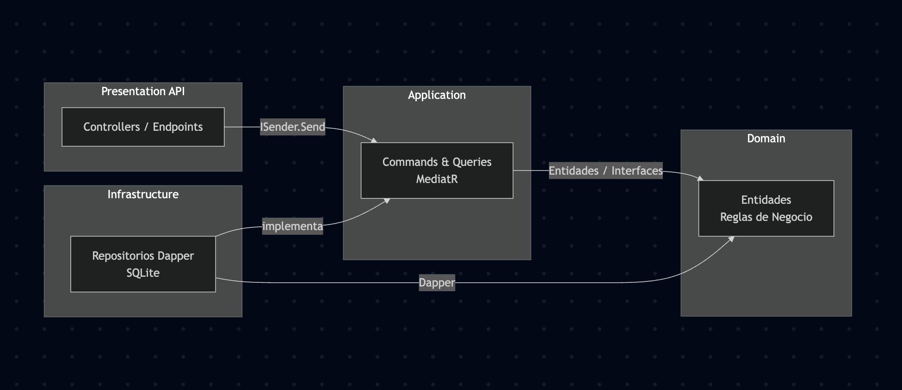

# Server

Domain -> Entidades, eventos de dominio... etc
Application -> DTOs, Commands/Queries (CQRS), Validación, Interfaces de repositorio
Infrastructure -> Respositorios Dapper, Servecios externos, etc...
Api -> Endpoints, filtros

